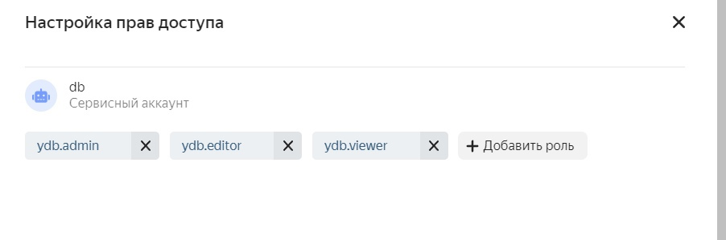

# Connection to yandex database with Python/Golang
To connect to the database, you must create a service account.
To do this, go to https://console.cloud.yandex.ru/folders/ \
to the `Service Accounts` tab and click `Create Service Account`. 
  

  
After creating a service account, go to your database in the tab `Access rights` and click `Assign roles`. \
Assign the desired roles to the service account:
  

  
In the already known tab `Service accounts`, click on the created account and in the window that appears, select:

`Create new key -> Create authorized key` 

Download the json file with the key. \
  

  
The fields `ENDPOINT` and `DATABASE` can be found on the main page of your database in the `Connection` section:
  

